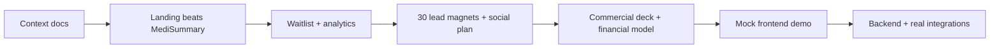

# Alivia AI — Platform Features & Product Context

> Sharpened product specification derived from *Requerimientos Alivia* and legacy codebases (`Alivia/`, `alivia_front/`).  
> **Competitive north star:** beat [MediSummary](https://www.medisummary.com/?lang=es) for **medical residents and undergraduates in LATAM** — not attending physicians in the US.

---

## 1. Vision & Positioning

**Alivia AI** is a subscription PWA for medical residency students and undergraduates who juggle clinical duties, academic load, and exam prep — often in Spanish, often without time to read.

| Dimension | Alivia | MediSummary (reference) |
|-----------|--------|-------------------------|
| **ICP** | Residents & med students (LATAM) | Practicing physicians (global, US-centric) |
| **Language** | Native Spanish, LATAM guidelines | Translated, US workflow |
| **Price anchor** | Free students · ~$7.99/mo residents | ~$197/year founder rate |
| **Core loop** | Patient encounter → PubMed → nightly study list | Articles → summaries → notes → slides |
| **Trust** | PMID-verified, zero hallucinated citations | PubMed citations, 9-tool suite |

**Value proposition (one line):**  
*The AI that gives you back your sleep — listens to your rounds, searches PubMed for you, and tells you exactly what to study tonight. In Spanish. With real citations.*

---

## 2. Ideal Customer Profile (ICP)

### Primary persona — **Residente LATAM**
- Age 24–32, R1–R4 or internado
- 60–80 h/week between hospital and study
- Commutes by bus/metro; reads poorly in transit
- Pays out of pocket; price-sensitive (~$8/mo max)
- Needs citations defensible in rounds (not “ChatGPT said so”)

### Secondary persona — **Estudiante de medicina (M3–M6)**
- Preparing for internado / Examen Único Nacional
- University email for verification → **free tier forever**

### Tertiary persona — **Director de residencia / Decanato**
- Wants better-prepared residents, retention, accreditation metrics
- **Institutional tier** — custom pricing, dashboards, onboarding

---

## 3. Problems We Solve (quantified framing)

| Pain | Symptom | Alivia outcome |
|------|---------|----------------|
| Burnout & sleep loss | Notes/study after 9 pm | Encounter → cited plan in ~90 s |
| Incomplete tasks | Clinical + academic backlog | Nightly study list from attending questions |
| Dead commute time | Reading on bus fails | 12-min podcast / audiobook per article |
| Patient-by-patient plans | Manual PubMed per case | MeSH extraction + live PubMed search |
| Attending gaps | “What did they ask?” forgotten | Capture + quiz for that night |
| Congress / guidelines drift | Missed NEJM / MinSalud updates | Daily briefing feed |
| Literature overload | 40 saved, 3 read | Summaries + library with read/unread |
| Exam prep scatter | Generic Anki in English | Specialty + year + country-aligned quizzes |
| Unsafe AI | Hallucinated PMIDs | **Zero** clinical claim without verifiable PMID |

---

## 4. Platform Modules (feature map)

### 4.1 Landing & Growth (Phase 1 — current)

| Feature | Description | Success metric |
|---------|-------------|----------------|
| **Waitlist** | Email + university + specialty + demographics | Conversion rate, cohort size |
| **First 50 offer** | Lifetime Premium for verified early signups | Scarcity-driven signups |
| **Analytics** | Visits, section scroll, form completion, demographics | PostHog / similar |
| **Lead magnets** | 30 viral images/videos → tracked UTM links | CTR, waitlist attribution |
| **Bilingual** | ES primary, EN secondary | Locale split |
| **vs MediSummary page** | Objective comparison for SEO & sales | Organic traffic |

### 4.2 Authentication & Billing (mock → real)

| Feature | MVP mock | Production |
|---------|----------|------------|
| Register | University/hospital email form | Email verification + OAuth optional |
| Login | Local session | JWT / session + refresh |
| Profile | Name, specialty, year | Sync with backend |
| Subscription | Plan cards, trial UI | Stripe + institutional invoicing |

### 4.3 El Encuentro (Patient encounter) — *differentiator*

1. **Record** encounter (consent / teaching mode) → transcription  
2. **Extract** MeSH + non-MeSH terms  
3. **Search** PubMed API live  
4. **Present** articles → user approves sources  
5. **Generate** cited patient plan (every claim → PMID)  
6. **Capture** attending questions → **tonight’s study list** + quiz  

### 4.4 La Biblioteca (Paper library)

- Save papers from searches or uploads  
- Mark read / unread  
- Actions per paper: summary, podcast, audiobook, quiz, cited presentation, chat with paper, compare two papers  
- Export citations (AMA, Vancouver)  
- Tier limits: 5 papers/mo (Student) · unlimited (Resident Pro)

### 4.5 El Briefing (Daily intelligence)

- Morning digest: new papers in specialty  
- Congress highlights, guideline changes  
- 5-min read or 12-min commute audio  

### 4.6 Consultas / Patient queries (legacy: `alivia_front`)

- New clinical query workflow  
- Keyword builder (MeSH terms)  
- PubMed results with classification  
- Feedback loop on answers  
- **Mis artículos** — personal paper repository  
- **Mis pendientes** — task list from encounters  

### 4.7 Presentaciones (legacy)

- Generate presentation from certified or user literature  
- Customize themes  
- Import existing decks  
- Export PPTX with citations  

### 4.8 Trending & discovery

- **Artículos más citados** — highly cited feed  
- **Artículos en redes** — social trending (future)  

### 4.9 Cuestionarios & exam prep

- Quizzes from papers or attending questions  
- Iterative improvement (spaced repetition direction)  
- Exam prep by career year + specialty + country  

### 4.10 Perfil & suscripción

- Profile card, subscription management  
- Billing flow modal, plan upgrade  
- Usage limits & trial state  

### 4.11 Help & support

- FAQ (in-app + landing)  
- Contact / WhatsApp  
- Institutional “book a call”  

### 4.12 Trust, privacy & compliance

- Ley 1581/2012 (Colombia Habeas Data)  
- No clinical data for model training (contractual)  
- LATAM data residency target  
- Auditable generation logs  
- Cookie consent on landing  

---

## 5. Pricing (preliminary)

| Tier | Price | Audience |
|------|-------|----------|
| **Estudiante** | Free forever | Verified university email |
| **Residente Pro** | $7.99/mo (~$79/yr) | Full platform |
| **Institución** | Custom | Universities & hospitals |

**Founder cohort:** first 50 waitlist → Premium free for life.

---

## 6. Go-to-market sequence

1. **Now:** Landing, waitlist, mocked app shell for demos  
2. **Next:** Lead magnets (Higgs MCP / creative pipeline), measurable UTMs  
3. **Then:** University/hospital deck + TAM/SAM/SOM model  
4. **Then:** Full mock UI per module → investor / pilot demos  
5. **Later:** PubMed, Anthropic, audio, Stripe, institutional SSO  

---

## 7. Market sizing (to document)

| Metric | Notes |
|--------|-------|
| **TAM** | ~3M+ med students + residents worldwide; LATAM ~400–600K in training |
| **SAM** | Spanish-speaking trainees with smartphone + PubMed need |
| **SOM** | Year-1: Colombia + Mexico residency programs via waitlist + 2–3 pilot institutions |

*Fill with sourced numbers in financial model.*

---

## 8. Technical stack (target)

| Layer | Choice |
|-------|--------|
| Landing + app shell | React (Vite), TypeScript, Tailwind |
| PWA | Service worker, install prompt |
| State | Zustand or Redux (legacy uses Redux) |
| AI | Anthropic + RAG on certified corpus |
| Literature | PubMed API, MeSH |
| Audio | TTS pipeline for podcasts/audiobooks |
| Analytics | PostHog |
| Payments | Stripe |

---

## 9. MVP demo scope (mock frontend)

**Must ship for validation:**
- [x] Landing (all sections, ES/EN)
- [x] Waitlist form (localStorage mock)
- [x] Login / Register (mock auth)
- [x] App navbar + sidebar placeholders per module
- [ ] Per-module mock screens (iterate one by one with user)

**Explicitly out of scope for mock:** real PubMed, recording, payments, email send.

---

## 10. Open decisions

1. Specialty launch order: Interna, Pediatría, Gine, Cirugía, Familiar — confirm  
2. Institutional pilot: which university first?  
3. Audio language: ES only at launch or bilingual summaries?  
4. Recording consent UX: hospital-specific vs global flow?

---

*Last updated: June 2026 · Alivia AI S.A.S · Bogotá, Colombia*
